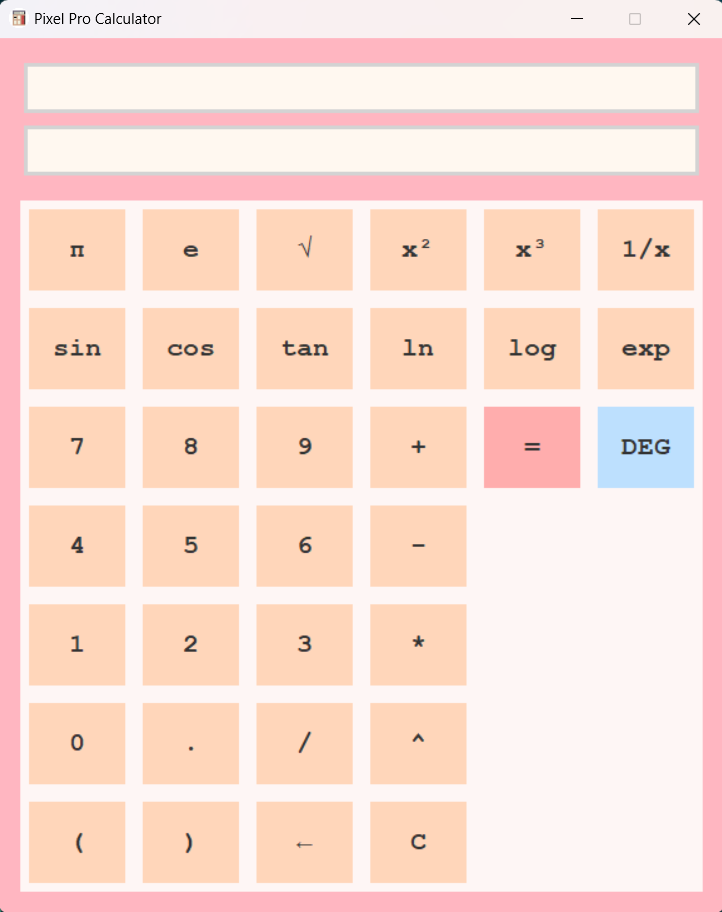

# scientific-calc-tkinter 🔢

A **Tkinter-based Scientific Calculator** built with Python. This app supports basic and scientific operations, including trigonometric, logarithmic, and exponential functions, as well as angle mode switching (DEG/RAD).



## ✨ Features

- Basic arithmetic operations: `+`, `-`, `*`, `/`, `^`
- Scientific functions: `sin`, `cos`, `tan`, `log`, `ln`, `sqrt`, `exp`, etc.
- Angle mode toggle between Degrees and Radians
- Clean pixel-style GUI using Tkinter
- Keyboard/mouse input support
- Error handling and backspace support

## 📦 Requirements

Python 3.x and the following libraries:
- tkinter
- math

> Most of these are included in the Python standard library. No external dependencies required.

## 🚀 How to Run

1. Clone this repository:

```bash
git clone https://github.com/yourusername/scientific-calc-tkinter.git
cd scientific-calc-tkinter
```

2. Run the calculator:

```bash
python calculator.py
```

## 📝 License

This project is licensed under the [MIT License](LICENSE).

<p align="center"><b>Finish what you started 💻 </b></p>
